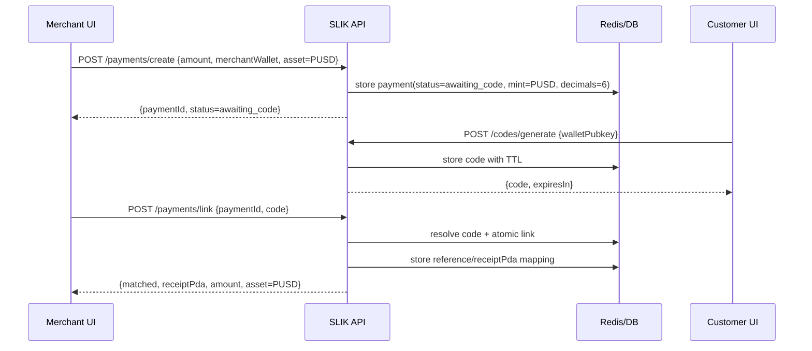
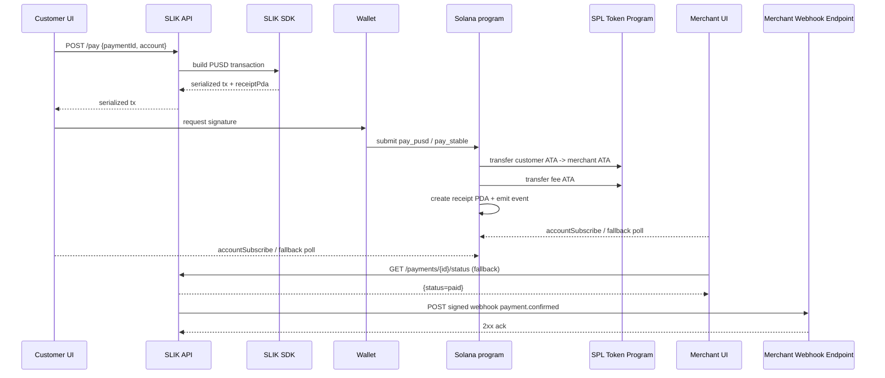
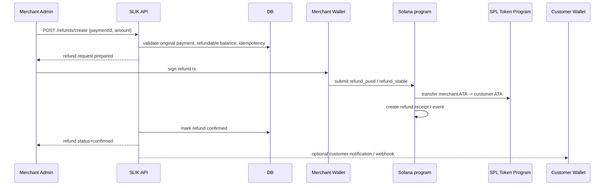
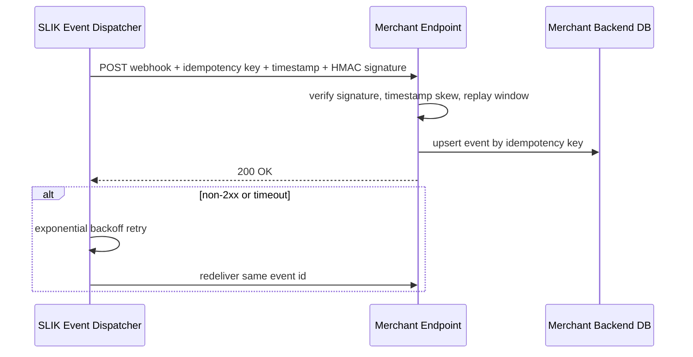

# Palm USD Integration Plan for SLIK on Solana

## Executive summary

The core conclusion is simple: integrating entity["cryptocurrency","Palm USD","PUSD stablecoin"] into SLIK is technically feasible without a Palm-specific SDK, but the real work is **mainnet readiness, token abstraction, receipt correctness, and merchant-grade operational hardening**, not Palm API integration itself. The strongest reading of Palm’s official developer docs is that PUSD on Solana behaves like a standard SPL token with 6 decimals, with no proprietary wallet, no SDK requirement, no API auth for public data, and no Palm webhooks required for basic token movement; Palm explicitly says that if code already works with entity["cryptocurrency","USDC","USD Coin stablecoin"], it should work with PUSD. citeturn6view0

That matters because `urltomaszstefaniak/palm-slikhttps://github.com/tomaszstefaniak/palm-slik` already has a stablecoin branch: it supports `"SOL" | "USDC"` in the payment handlers, has a token-specific transaction builder, creates associated token accounts for the merchant and fee wallet when needed, and already uses an Anchor instruction for token payments. The current implementation is therefore **closer to PUSD than a greenfield build would be**. fileciteturn22file0L157-L205 fileciteturn27file0L21-L32 fileciteturn28file0L41-L115 fileciteturn30file0L69-L113

The blockers are equally clear. The reviewed SLIK codebase still defaults to **devnet**, the token path is hardcoded to a **devnet USDC mint**, and the on-chain `Receipt` / `PaymentCompleted` structures do **not** encode token mint, symbol, or decimals. The SDK’s receipt parser also derives `amountSol` from `LAMPORTS_PER_SOL`, which is wrong for token receipts. Palm’s Solana deployment is documented as **mainnet-only** with mint `CZzgUBvxaMLwMhVSLgqJn3npmxoTo6nzMNQPAnwtHF3s`, so a credible PUSD implementation requires a mainnet deployment plan and a more self-describing receipt model. fileciteturn21file0L5-L34 fileciteturn20file0L213-L239 fileciteturn27file0L21-L32 fileciteturn30file0L7-L10 fileciteturn30file0L206-L224 fileciteturn39file0L8-L45 citeturn6view0

For the submission angle, the best positioning is **not** “SLIK now supports another stablecoin.” The stronger framing is: **SLIK becomes a Palm USD-native, spoken-code in-person checkout flow on Solana**, with Palm-first UX, Palm mint verification, and Palm transparency links. The urlSuperteam Earn listingturn5search0 is a Palm USD frontier track on Superteam, with 10k PUSD in prizes and the winner announcement scheduled for **May 26, 2026**, so the implementation plan below is optimized for a compressed pre-submission schedule rather than a leisurely roadmap. citeturn5search0

## Current-state audit

Two repos were reviewed first via the GitHub connector: `urltomaszstefaniak/palm-slikhttps://github.com/tomaszstefaniak/palm-slik` and `urltomaszstefaniak/trattoria-rucolahttps://github.com/tomaszstefaniak/trattoria-rucola`. The first is the actual payment stack. The second is a separate restaurant-facing frontend and, in the files reviewed, does **not** contain payment infrastructure, Solana libraries, or backend API logic. fileciteturn17file0L1-L42 fileciteturn9file0L1-L32 fileciteturn15file0L1-L35

### Repository findings

| Repo / file(s) | Current responsibility | What matters for Palm USD | Suggested change |
|---|---|---|---|
| `trattoria-rucola/package.json`, `src/App.tsx`, `src/layouts/MainLayout.tsx`, `src/pages/Restaurants.tsx` | Vite + React Router restaurant operations frontend, route-based pages, mock restaurant selection and dashboard shell. No blockchain/payment dependencies in the reviewed files. fileciteturn9file0L1-L32 fileciteturn15file0L1-L35 fileciteturn47file0L1-L15 fileciteturn19file0L1-L60 | Not a payment engine; useful only as a **merchant-brand integration shell** or demo surface. | Keep separate from settlement logic. Add “Pay with Palm USD” entry points that either embed the SLIK merchant SDK or deep-link to the Palm-enabled SLIK terminal. |
| `palm-slik/package.json`, `README.md` | Monorepo-style Next.js app with local `@slik-pay/sdk` and `@slik-pay/server`, Anchor program, merchant and customer UIs, catch-all API route, Redis-backed code/payment state, optional database. fileciteturn17file0L5-L42 fileciteturn20file0L29-L57 fileciteturn20file0L120-L150 fileciteturn20file0L192-L239 | This is the real Palm integration target. | Use this as the source of truth. Create a Palm-focused branch and keep `trattoria-rucola` as an optional merchant demo consumer. |
| `src/app/api/[...path]/route.ts` | Single Next.js API entrypoint; configures RPC, Redis or in-memory fallback, optional DB, exports `GET` and `POST` handlers. fileciteturn21file0L5-L34 | Good extensibility point for Palm read-only API proxy/cache and internal merchant webhooks. Current default is devnet. | Default production to `mainnet-beta`; keep dev/test override. Add Palm API cache route and a signed internal webhook dispatcher. |
| `packages/server/src/handlers.ts`, `packages/server/src/types.ts` | Payment creation, code generation, code linking, status checks, merchant register/profile, and `/pay` transaction construction. Currency enum is currently `"SOL" | "USDC"`. fileciteturn22file0L157-L205 fileciteturn22file0L360-L410 fileciteturn41file0L7-L20 | This is where PUSD becomes first-class in the off-chain flow. | Replace hardcoded `"USDC"` with a token descriptor or `"PUSD"` path; store mint + decimals + asset kind, not just a 2-value enum. |
| `packages/sdk/src/constants.ts`, `packages/sdk/src/instructions.ts`, `packages/sdk/src/transactions.ts` | Program constants, instruction encoding, token ATA derivation/creation, and transaction assembly. Token flow is currently hardcoded to a devnet USDC mint and a `pay_usdc` discriminator. fileciteturn27file0L21-L32 fileciteturn29file0L63-L117 fileciteturn28file0L41-L115 | This is the cleanest insertion point for Palm mint substitution or generalization. | Refactor to `createPayStableTransaction` / `buildPayStableInstruction`, parameterized by mint, decimals, symbol, and fee ATA. |
| `programs/slik/src/lib.rs` | On-chain `pay` and `pay_usdc` instructions, fee extraction, receipt PDA creation, payment event emission. Token mint is hardcoded to devnet USDC. Receipt stores only customer, merchant, amount, payment_id, timestamp, bump. fileciteturn30file0L7-L10 fileciteturn30file0L69-L113 fileciteturn30file0L206-L224 | Current receipt model is not safe for a mixed SOL/PUSD system because the receipt does not say what asset was paid. | Add mint, decimals, asset enum/code, fee amount, and net amount to receipt/event. Either rename `pay_usdc` to `pay_pusd` for the submission or generalize to `pay_spl_stable`. |
| `packages/sdk/src/receipt.ts` | Parses receipt accounts and exposes `amountSol`, based on lamports. fileciteturn39file0L8-L45 | This is incorrect for token receipts. | Replace `amountSol` with asset-aware parsing; expose raw atomic amount, decimals, display amount, and mint. |
| `packages/server/src/db/schema.ts` | Merchant registry and merchant transaction tables, including `currency`, `fee`, `signature`, and `receiptPda`. fileciteturn25file0L3-L30 | Good starting schema for Palm payment history and refunds. | Extend with `mint`, `asset_symbol`, `refund_status`, `refunded_amount`, `webhook_delivery_status`, and reconciliation timestamps. |

### Audit verdict

`palm-slik` already has the right **shape** for Palm USD: SDK + server + UI + Anchor, plus an existing stablecoin path. The repo is not blocked by Palm’s external APIs. It is blocked by **devnet assumptions**, **USDC-specific constants**, and **receipt/schema design** that are too narrow for a Palm-first mainnet product. fileciteturn20file0L29-L57 fileciteturn21file0L5-L34 fileciteturn22file0L157-L205 fileciteturn27file0L21-L32 fileciteturn30file0L206-L224

`trattoria-rucola` should not be treated as Palm settlement infrastructure. It is useful as a merchant demo front-end, not as the Palm integration base. fileciteturn9file0L1-L32 fileciteturn15file0L1-L35

## Palm USD fit and flow mapping

Palm’s official position is unusually favorable to this project: PUSD on Solana is a standard SPL token with 6 decimals, Palm exposes public no-auth read APIs for circulation and history, and Palm explicitly says no Palm SDK or webhook setup is required for token-level integration. I infer from that documentation that the **checkout critical path should remain entirely inside SLIK + Solana**, while Palm’s public API should be treated as an **optional trust/transparency sidecar**, not as a dependency for transaction authorization or confirmation. citeturn6view0

The second crucial fact is network alignment. The current SLIK app and program are still documented around devnet, while Palm’s Solana mint is documented as live on mainnet with mint authority locked. That means the production Palm implementation cannot be a devnet-only demo; it either needs a true mainnet deployment or a dual-mode design where dev/test use a mock stable mint and production uses Palm’s mainnet mint. fileciteturn20file0L213-L239 fileciteturn21file0L5-L34 citeturn6view0

### Palm mapping table

| SLIK flow step | Current implementation | Palm USD mapping | Required component change |
|---|---|---|---|
| Merchant creates payment | Off-chain `POST /payments/create`; amount stored with `currency: "SOL" | "USDC"`. fileciteturn22file0L157-L205 | Treat PUSD as the stablecoin asset. Do **not** call Palm APIs here. | Change payment model to store `asset_symbol`, `mint`, `decimals`, `token_program`, `display_currency`. |
| Customer generates 6-digit code | Off-chain code issuance in store with TTL. fileciteturn20file0L29-L57 | No Palm dependency. | Keep flow unchanged; add anti-abuse metrics and merchant auth around linking. |
| Merchant links code to payment | Off-chain atomic link and receipt PDA derivation. fileciteturn22file0L214-L260 | No Palm dependency. | Preserve atomic link, but include asset metadata in linked payment state. |
| Build payment transaction | `/pay` chooses SOL vs USDC transaction builder. fileciteturn22file0L360-L410 | Switch stable branch to PUSD, using Palm mint on Solana. | Generalize stable builder or implement `pay_pusd`. |
| Token account handling | SDK derives merchant and fee ATAs and creates them if missing. fileciteturn28file0L41-L115 | Same ATA pattern works for PUSD because Palm docs describe a standard SPL token. citeturn6view0turn9view0 | Parameterize ATA derivation by Palm mint; add customer-balance and customer-ATA preflight checks. |
| On-chain transfer | `pay_usdc` uses token transfer and hardcoded USDC mint. fileciteturn30file0L69-L113 | Replace hardcoded mint with Palm mint or a whitelisted stable token config. | Add mint-aware receipt/event fields; prefer checked token transfer semantics for stronger precision validation. citeturn10view0 |
| Confirmation | Receipt PDA + WebSocket account-change watch, with HTTP polling fallback. fileciteturn20file0L46-L57 fileciteturn39file0L52-L105 | Palm has no transaction webhooks to consume here. | Keep receipt watch; add DB-backed reconciliation and internal merchant webhooks. |
| Transparency / trust UI | Current stack has no Palm-specific trust surface. | Palm public API can show circulation and, later, reserve/peg metadata. Palm read endpoints are no-auth and softly rate-limited. citeturn6view0 | Add server-side cached Palm widget; keep it off the checkout critical path. |
| Refunds | Not a complete productized flow in the reviewed code. | Palm does not provide refund webhooks or refund APIs for token movement. Refund is your on-chain/off-chain design problem. citeturn6view0 | Add `refund_pusd` or generic refund path plus signed internal merchant webhooks. |

### Recommended target architecture

The best implementation target is **Palm-first, internally generic**:

```ts
export const STABLE_ASSET = {
  symbol: "PUSD",
  mint: process.env.NEXT_PUBLIC_PALM_USD_MINT!,
  decimals: 6,
  tokenProgram: "spl-token",
  docsUrl: "https://www.palmusd.com/pages/developers.html",
  publicApiBase: "https://www.palmusd.com/api/v1",
} as const;
```

That gives you the best of both worlds: the public product and hackathon submission are **Palm-exclusive**, but the code still avoids baking Palm-specific strings into every internal primitive.

### Sequence diagrams

#### Payment creation



#### Payment confirmation



#### Refund



#### Webhook handling



These flows are consistent with the current SLIK code structure, Palm’s no-auth/no-SDK token guidance, Palm’s public circulation endpoints, and Solana’s standard ATA + token transfer model plus WebSocket account subscriptions. fileciteturn20file0L29-L57 fileciteturn22file0L214-L260 fileciteturn22file0L360-L410 fileciteturn28file0L41-L115 fileciteturn30file0L69-L113 citeturn6view0turn9view0turn10view0turn10view5

## Milestones and timeline

Because the Superteam track’s winner announcement is scheduled for **May 26, 2026**, the sensible plan is a compressed delivery window that prioritizes **Palm-exclusive checkout first**, with refunds and richer merchant ops immediately after. citeturn5search0

### Milestone plan

| Milestone | Scope | Deliverables | Effort | Dependencies | Risk notes |
|---|---|---|---|---|---|
| **1. Palm architecture freeze** | Decide product posture: Palm-exclusive stablecoin UX, mainnet target, receipt schema, merchant auth model | Architecture decision record, branch strategy, Palm mint constants, updated data model, threat model | Medium | None | Biggest risk is pretending this is a “simple token swap” when it is actually a mainnet hardening exercise. |
| **2. Stablecoin abstraction and Palm constants** | Replace USDC-specific constants and union types with Palm-first token config | Generic stable token config, PUSD mint wiring, API/type changes, SDK rename/refactor | Medium | Milestone 1 | Risk of partial refactor leaving USDC strings, labels, or assumptions behind. |
| **3. On-chain Palm settlement** | Upgrade or redeploy program for PUSD-aware receipts/events and mainnet-safe instruction behavior | New Anchor instruction set, receipt schema, IDL update, SDK parser update, mainnet deployment plan | High | Milestone 2 | Mainnet-only Palm mint means devnet smoke tests need mock mint support. |
| **4. Merchant/customer UX and internal webhooks** | Palm-first UI, merchant auth, signed internal status webhooks, Palm transparency widgets | PUSD-only or PUSD-default UX, merchant session flow, webhook dispatcher, Palm circulation widget | High | Milestone 2; ideally 3 | Merchant auth is critical; without it, spoken-code checkout is too easy to spoof. |
| **5. Refunds and reconciliation** | Add refund workflow plus durable reconciliation between off-chain state and on-chain receipts | Refund API/tx flow, reconciliation worker, ledger views, retryable webhook logic | High | Milestone 3 | Refunds are new product scope, not a cosmetic addition. |
| **6. Mainnet launch and submission package** | Production deployment, canary, test evidence, submission assets | Deployment checklist, smoke-test evidence, demo script, architecture diagrams, final README | Medium | Milestones 1-5 | Public RPC is not suitable for production; dedicated RPC and rollback switches are required. citeturn10view3 |

### Suggested timeline

A realistic compressed timeline, starting from **Sunday, May 10, 2026**, is:

| Date window | Focus |
|---|---|
| **May 10–11** | Milestone 1: architecture freeze, receipt schema, auth model, branch setup |
| **May 12–14** | Milestone 2: SDK/server refactor from USDC-specific to PUSD-first stable asset |
| **May 15–18** | Milestone 3: Anchor program update, parser changes, dev/test stable mint path, mainnet dress rehearsal |
| **May 19–21** | Milestone 4: Palm-first UI, internal webhooks, merchant auth, transparency widget |
| **May 22–23** | Milestone 5: refund MVP + reconciliation job |
| **May 24–25** | Milestone 6: production checklist, demo recording, submission polish, supervisor sign-off |

If schedule pressure forces scope cuts, the **submission-critical subset** is: Milestones 1–4 plus a minimal reconciliation worker. Refunds can land immediately after submission if needed.

## Gemini delivery matrix

Below is the recommended task split for the external contractor (“Gemini”) under your supervision.

### Delivery tasks by milestone

| Milestone | Workstream | Task | Assignee |
|---|---|---|---|
| 1 | Developer | Write architecture memo: Palm-exclusive product posture, PUSD mint config, receipt/event schema, environment strategy | Gemini |
| 1 | Developer | Replace all `USDC`-specific type unions in planning docs with `PUSD` or generic stable asset descriptors | Gemini |
| 1 | QA | Produce risk-based test matrix for mainnet vs mock/dev environments | Gemini |
| 1 | DevOps | Create branch + preview environment strategy and secret inventory | Gemini |
| 1 | Review | Approve architecture memo, mint address, and submission posture | Supervisor |
| 2 | Developer | Refactor `currency: "SOL" | "USDC"` into asset-aware types (`assetSymbol`, `mint`, `decimals`) | Gemini |
| 2 | Developer | Replace stablecoin constants in SDK/instructions/transactions with Palm-first config | Gemini |
| 2 | Developer | Update API request/response types and DB schema migrations | Gemini |
| 2 | QA | Add unit tests for payment model serialization and API validation | Gemini |
| 2 | Review | Approve API surface and product naming: “Palm USD” vs “PUSD” | Supervisor |
| 3 | Developer | Implement `pay_pusd` or generic `pay_stable` in Anchor with mint-aware receipt/event | Gemini |
| 3 | Developer | Update IDL, SDK builders, parser, watchers, and transaction deserialization paths | Gemini |
| 3 | Developer | Add mock stable mint support for local/dev/test while keeping Palm mainnet mint for prod | Gemini |
| 3 | QA | Run local validator tests and testnet-like dry runs with mock stable mint | Gemini |
| 3 | DevOps | Prepare mainnet deploy checklist, program upgrade authority handling, and canary rollback plan | Gemini |
| 3 | Review | Approve program ABI/receipt schema before any mainnet deployment | Supervisor |
| 4 | Developer | Build Palm-first merchant and payer UX; remove or hide USDC branding in submission build | Gemini |
| 4 | Developer | Add merchant authentication flow (wallet-signed session) before create/link actions | Gemini |
| 4 | Developer | Add signed webhook dispatcher and merchant endpoint contract | Gemini |
| 4 | Developer | Add Palm transparency widget using cached public API data | Gemini |
| 4 | QA | E2E test full purchase flow across merchant + customer clients | Gemini |
| 4 | Review | Approve branding, copy, and Palm-specific demo narrative | Supervisor |
| 5 | Developer | Implement refund request model, validation rules, and refund transaction path | Gemini |
| 5 | Developer | Implement reconciliation worker: receipt scan, webhook replay, mismatch reporting | Gemini |
| 5 | QA | Run refund, duplicate refund, and missed-webhook recovery scenarios | Gemini |
| 5 | DevOps | Add scheduled reconciliation job and alerting | Gemini |
| 5 | Review | Approve refund policy and any manual-ops fallback | Supervisor |
| 6 | Developer | Final README, demo script, architecture diagrams, operator handbook | Gemini |
| 6 | QA | Execute full acceptance suite and capture evidence artifacts | Gemini |
| 6 | DevOps | Mainnet release, canary merchant rollout, monitoring dashboards, rollback toggles | Gemini |
| 6 | Review | Final go/no-go and submission sign-off | Supervisor |

### Acceptance checklist by milestone

| Milestone | Acceptance checklist |
|---|---|
| 1 | Palm mainnet mint is fixed; receipt schema is agreed; branch strategy and env matrix are approved; security gaps are explicitly logged. |
| 2 | No production path depends on `USDC` constants; payment types carry mint/decimals; API docs and migrations are updated. |
| 3 | New receipt/event format parses correctly for PUSD; mainnet config is isolated; mock stable mint works in non-production environments. |
| 4 | Merchant and payer UIs visibly present Palm USD; merchant create/link endpoints require auth; webhook signatures verify; Palm widget is cached and non-blocking. |
| 5 | Refunds cannot exceed original captured amount; duplicate refund attempts are blocked; reconciliation can repair stale off-chain status. |
| 6 | Canary passes; dashboards and alerts are live; evidence bundle is complete; README and demo clearly show Palm-exclusive value. |

## Acceptance, security, and operations

### Final acceptance criteria

| Category | Required outcome |
|---|---|
| Functional | Merchant can create a Palm USD payment, customer can generate a 6-digit code, merchant can link it, customer can approve with a wallet, and both sides see confirmed status from the receipt PDA. |
| Functional | Merchant fee routing works and is visible in receipt/event state. |
| Functional | Merchant/customer ATAs are handled correctly; missing merchant or fee ATAs do not break checkout. |
| Functional | Palm transparency widget loads independently and never blocks payment creation or confirmation. |
| Functional | Refund flow works for full and partial refunds, or is explicitly deferred behind a non-production flag if not in v1 scope. |
| Security | Merchant action endpoints require authenticated merchant sessions; webhook endpoints verify HMAC signatures and reject replays. |
| Security | Secrets are not stored in repo; upgrade authority and webhook secrets are isolated per environment. |
| Security | Mainnet build rejects devnet token/program mismatches at startup. |
| Performance | `/payments/create` and `/payments/link` remain fast under normal load; payment confirmation via WebSocket is near-real-time, with polling fallback if subscriptions fail. |
| Operations | Reconciliation can mark a payment paid even if webhook dispatch or UI subscription fails. |
| Operations | Production uses dedicated RPC, not shared public RPC. citeturn10view3 |

### Suggested automated tests

Use a layered suite:

| Test layer | What to test |
|---|---|
| Unit | Asset config parsing, amount conversion, webhook signature verification, refund arithmetic, idempotency keys |
| API integration | `POST /payments/create`, `POST /payments/link`, `POST /pay`, webhook delivery, Palm widget cache route |
| SDK integration | Receipt parsing, ATA derivation, PUSD transaction builder, parser behavior on SOL vs PUSD receipts |
| Program tests | `pay`, `pay_pusd`/`pay_stable`, fee calculation, wrong mint rejection, duplicate receipt prevention |
| End-to-end | Merchant browser + customer browser + wallet signing + status propagation + webhook receipt |
| Reconciliation | Forced mismatches between Redis/DB state and on-chain receipt, followed by repair run |

### Manual test vectors

| Vector | Expected result |
|---|---|
| PUSD payment with merchant ATA already present | Successful payment, correct fee, correct receipt |
| PUSD payment with merchant ATA missing | ATA created, payment succeeds |
| PUSD payment with fee ATA missing | ATA created, payment succeeds |
| Customer enters code but code expires before link | Merchant gets expiry path, no stale payment remains linked |
| Same code linked twice | Exactly one link succeeds; second gets conflict |
| Customer lacks sufficient PUSD balance | Wallet/UX shows failure before or during signing; no false “paid” state |
| WebSocket subscription drops | Polling fallback still reaches `paid` |
| Webhook delivered twice | Merchant backend processes once via idempotency key |
| Partial refund after successful payment | Refund succeeds, remaining refundable balance updated |
| Refund larger than captured amount | Reject with validation error |
| Wrong mint configured in environment | App fails startup checks or rejects stable payment path |
| Palm public API unavailable | Palm widget degrades gracefully; checkout still works |

### Security and compliance observations

The current mainnet risk is not Palm. It is **merchant spoofing and operational trust**. In the reviewed handlers, payment creation is driven by a submitted `merchantWallet` string and the reviewed flow does not show a merchant authentication layer before create/link actions. That is acceptable for a prototype, but not for a Palm-first mainnet checkout system where a spoken 6-digit code could be socially engineered. Merchant actions should require a wallet-signed session or equivalent signed challenge before the create/link lifecycle begins. fileciteturn22file0L157-L205

Palm’s docs also matter on the compliance side: Palm emphasizes that contract-level compliance is minimal and that KYC/KYB/sanctions controls live at the perimeter, not in the token contract. For this product, the practical translation is: do not confuse “non-freezable token” with “no compliance obligations.” If onboarding merchants, keep KYB/allowlisting outside the chain logic; if the demo remains closed-loop, keep that scope explicit in docs. citeturn6view0

On-chain, I recommend strengthening the stablecoin path by making the receipt self-describing and by using mint/precision-aware transfer semantics for the stable token path. Solana’s docs explicitly recommend checked token transfers when precision validation matters, and they also document deterministic ATA creation via the Associated Token Program. That aligns well with a Palm-first stablecoin checkout. citeturn9view0turn10view0

Operationally, use:
- **Dedicated RPC** for production, because Solana’s shared public RPC endpoints are not intended for production traffic and may return rate-limit or block responses. citeturn10view3
- **Two confirmation planes**: fast UX on `confirmed`, plus background reconciliation to `finalized` or equivalent durable checks. Solana’s commitment documentation supports that separation. citeturn10view4turn10view5
- **Server-side Palm API caching** for circulation/history widgets because Palm documents public no-auth endpoints with a soft rate limit of 60 requests per minute per IP. citeturn6view0

## Repository workflow, configuration, and references

### Recommended repository strategy

Use `urltomaszstefaniak/palm-slikhttps://github.com/tomaszstefaniak/palm-slik` as the implementation repo and keep `urltomaszstefaniak/trattoria-rucolahttps://github.com/tomaszstefaniak/trattoria-rucola` as an optional merchant-branded integration consumer. The simplest branching model is:

- `main` — protected, releasable
- `integration/palmusd` — active staging branch for Gemini
- `feat/pusd-core`
- `feat/pusd-program`
- `feat/pusd-ui-webhooks`
- `feat/pusd-refunds`
- `release/palm-mainnet-v1`

That keeps risky program changes isolated from UX work and lets you supervise merge order.

### CI/CD steps

The reviewed root package exposes build scripts but no root test script in the files reviewed, so CI should be added explicitly before mainnet release. fileciteturn17file0L5-L42

Recommended pipeline gates:

1. Typecheck and lint
2. SDK build
3. Server build
4. Next.js build
5. Unit tests
6. Program tests against local validator
7. API integration tests
8. Secret scan and dependency audit
9. Preview deploy for web
10. Tagged release deploy for mainnet configuration

### Sample `.env` template

```bash
# Network
NEXT_PUBLIC_SOLANA_NETWORK=mainnet-beta
NEXT_PUBLIC_RPC_ENDPOINT=https://your-dedicated-mainnet-rpc.example
NEXT_PUBLIC_PROGRAM_ID=YOUR_MAINNET_PROGRAM_ID

# Palm USD
NEXT_PUBLIC_PALM_USD_MINT=CZzgUBvxaMLwMhVSLgqJn3npmxoTo6nzMNQPAnwtHF3s
NEXT_PUBLIC_PALM_USD_DECIMALS=6
ENABLE_PALM_USD_ONLY=true

# Fees
SLIK_FEE_BPS=20
NEXT_PUBLIC_FEE_WALLET=YOUR_MAINNET_FEE_WALLET

# Storage
UPSTASH_REDIS_REST_URL=
UPSTASH_REDIS_REST_TOKEN=
DATABASE_URL=

# Internal webhooks
WEBHOOK_SIGNING_SECRET=
WEBHOOK_RETRY_MAX_ATTEMPTS=8
WEBHOOK_TIMEOUT_MS=5000

# Palm public API cache
PALM_PUBLIC_API_BASE=https://www.palmusd.com/api/v1
PALM_PUBLIC_API_CACHE_TTL_SECONDS=300

# Dev / test only
TEST_STABLE_MINT_OVERRIDE=
ENABLE_MOCK_STABLECOIN=false
```

### PR review checklist

| Check | Why it matters |
|---|---|
| Palm mint matches official docs exactly | Prevents fake-mint integration |
| No production code path references devnet USDC constant | Eliminates mixed-environment mistakes |
| Receipt/event schema includes mint + decimals + fee/net fields | Enables reliable reconciliation |
| Merchant auth is enforced on create/link/refund endpoints | Prevents spoofed merchant actions |
| Webhooks are signed, timestamped, and idempotent | Prevents replay/double-booking |
| Tests cover missing ATAs, duplicate links, expired codes, webhook retries, refunds | Protects core business flows |
| Dedicated RPC endpoint is configured | Shared public RPC is not production-grade |
| Palm widget is cached and non-blocking | Palm API should not stall checkout |
| README/demo copy presents Palm USD as a primary capability | Aligns with submission narrative |

### References and prioritized sources

Primary implementation and audit sources:

- `urltomaszstefaniak/palm-slikhttps://github.com/tomaszstefaniak/palm-slik` — reviewed via GitHub connector, including package structure, routes, handlers, SDK, parser, and program files. fileciteturn17file0L5-L42 fileciteturn20file0L29-L57 fileciteturn21file0L5-L34 fileciteturn22file0L157-L205 fileciteturn22file0L360-L410 fileciteturn25file0L3-L30 fileciteturn27file0L21-L32 fileciteturn28file0L41-L115 fileciteturn30file0L69-L113 fileciteturn30file0L206-L224 fileciteturn39file0L8-L45
- `urltomaszstefaniak/trattoria-rucolahttps://github.com/tomaszstefaniak/trattoria-rucola` — reviewed via GitHub connector as a frontend shell, not a payment engine. fileciteturn9file0L1-L32 fileciteturn15file0L1-L35 fileciteturn47file0L1-L15 fileciteturn19file0L1-L60

Primary external sources:

- `urlPalm USD developer docsturn3view0` — canonical source for Palm token model, Solana mint address, no-auth public API, no-SDK/no-webhook guidance, rate limits, and upcoming reserves/peg endpoints. citeturn6view0
- `urlSolana token account docsturn9view0` and `urlSolana token transfer docsturn9view1` — ATA and checked-token-transfer guidance. citeturn9view0turn10view0
- `urlSolana RPC overviewturn9view2` and `urlaccountSubscribe docsturn9view3` — production RPC guidance, commitment levels, and WebSocket account subscriptions. citeturn10view2turn10view3turn10view4turn10view5
- `urlSuperteam Earn listingturn5search0` — submission context, prize structure, and date pressure. citeturn5search0

### Open questions and limitations

A few decisions should be made by you as supervisor before Gemini starts coding:

- Whether the submission build should expose **Palm USD only**, or **Palm USD + SOL** with Palm as default.
- Whether refunds must be **on-chain in v1** or can be launched as an immediate follow-up milestone.
- Whether you want to reuse the current program identity strategy on mainnet or publish a new mainnet program ID.
- Whether `trattoria-rucola` should be used only for demo polish, or whether you want it to become a real merchant frontend over the SLIK Palm-enabled backend.

My recommendation is blunt: **do not market this as a small Palm integration. Market it as a Palm USD-native checkout product, and engineer it like a mainnet payment system.**